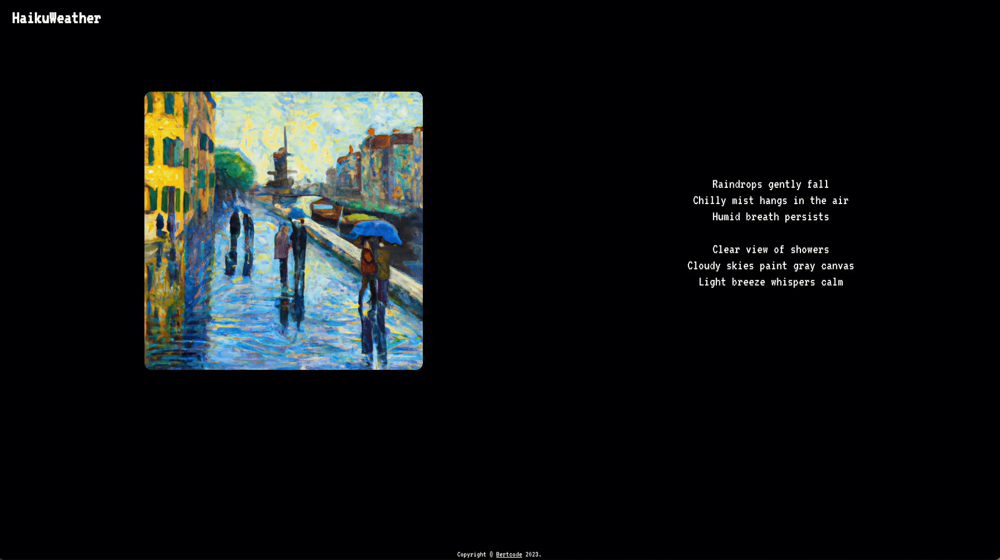
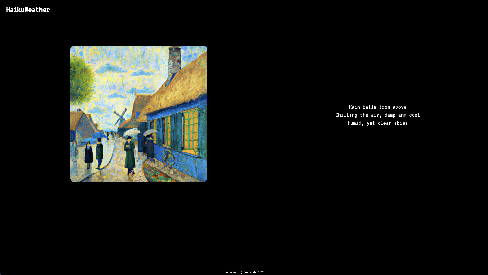
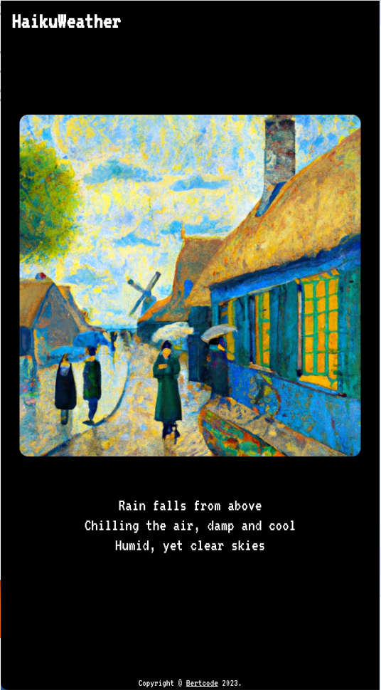

# Haiku Weather App

The Haiku weather App utilizes 3 API services to create a unique way to get your daily weather details. By using the OpenWeather API and parsing this data to digestable summaries, a prompt can be generated to OpenAI's LLM model to create a Haiku poem for us. This prompt is then used inspire the image generation model to create a painting in Van Gogh's style then displayed to users.

The location API is used on the browser so location permission is required. This information is used to identify the region to search with the OpenWeather API.

## Examples

## Services

OpenAI

- Image and report poem generation
- [Site](https://openai.com/)

OpenWeather

- Live weather data
- [Site](https://home.openweathermap.org/api_keys)
